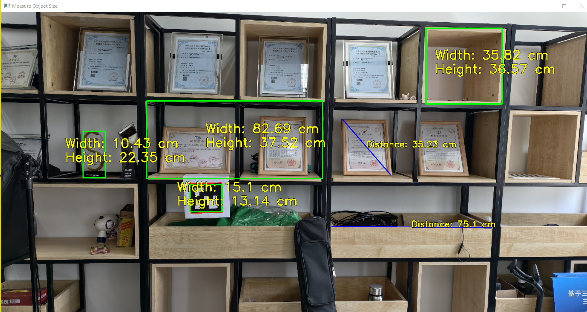

# Object Measurement Using Aruco Markers

## Measurement Results Display



## Overview

This project detects objects in an image and measures their size using Aruco markers as a reference. Users can manually select areas in the image to measure dimensions or detect objects automatically.

## Features

- **Accurate Size Measurement**: Measures the dimensions of objects based on the size ratio of recognized Aruco markers in the image and reality.
- **Manual Contour Drawing**: Allows users to manually select areas in the image by drawing contours with the left mouse button to detect the width and height of objects.
- **Two - Point Distance Measurement**: Supports measuring the distance between two points by right - clicking and selecting them in the image.
- **Camera Distortion Calibration**: Enables camera distortion calibration using a checkerboard to improve measurement accuracy.

## Installation

### Prerequisites

Before proceeding, ensure that you have Python installed on your system. It is recommended to use a virtual environment to manage dependencies effectively.

### Setting Up the Environment

1. **Create a Conda Environment**  
   Run the following command to create a new Conda environment named `aruco`:
   ```bash
   conda create -n aruco python=3.9
   ```

2. **Activate the Environment**  
   Activate the newly created environment using:
   ```bash
   conda activate aruco
   ```

3. **Install Dependencies**  
   Install the required packages by running the following command:
   
   ```bash
   pip install -r requirements.txt
   ```

---

## Usage

Once the environment is set up and dependencies are installed, you can proceed to run the code. Ensure that the `aruco` environment is activated before executing any scripts.

---

### 1. ArUCo Marker Generation

The file `generate_aruco_tags.py` generates ArUCo markers based on the specified ID, type, and output directory.

**Command:**
```bash
python generate_aruco_tags.py --id 24 --type DICT_5X5_100 -o output/tags/
```

- `--id`: The ID of the ArUCo marker to generate.
- `--type`: The dictionary type of the ArUCo marker (e.g., `DICT_5X5_100`).
- `-o`: The output directory where the generated marker will be saved.

For more details on available parameters, use:
```bash
python generate_aruco_tags.py --help
```

---

### 2. Camera Calibration

The file `calibration.py` generates the camera calibration matrix (`calibration_matrix.npy`) and distortion coefficients (`distortion_coefficients.npy`). These files are essential for correcting image distortions and performing accurate measurements.

**Command:**
```bash
python calibration.py --dir input/calibration_checkerboard/ --square_size 0.015 --width 11 --height 8
```

- `--dir`: Directory containing checkerboard images taken with your camera.
- `--square_size`: Real-world size (in meters) of each square on the checkerboard.
- `--width`: Number of inner corners along the width of the checkerboard.
- `--height`: Number of inner corners along the height of the checkerboard.

**Note:** The provided calibration files (`calibration_matrix.npy` and `distortion_coefficients.npy`) in this repository are specific to the author's camera and may not work well for other cameras. It is recommended to perform your own calibration.

---

### 3. Image Correction

The file `correct_image.py` corrects images where ArUCo markers appear skewed (e.g., as parallelograms or trapezoids) due to angled camera shots. It transforms the marker back into a square and aligns the entire image accordingly.

**Command:**
```bash
python correct_image.py --image input/images/image23.jpg
```

- `--image`: Path to the input image containing the skewed ArUCo marker.

**How It Works:**
- Detects the skewed ArUCo marker.
- Applies a perspective transformation to make the marker square.
- Corrects the entire image based on the marker's orientation.

**Recommendation:**
For best results, capture the ArUCo marker directly facing the camera. Shooting at an angle may reduce correction accuracy.

---

### 4. Object Measurement in Images

The file `measure_object_image.py` measures the dimensions of objects in an image using a specified ArUCo marker size.

**Command:**
```bash
python measure_object_image.py --side 4.5 --image input/images/image9.jpg
```

- `--side`: Real-world side length (in cm) of the ArUCo marker used for calibration.
- `--image`: Path to the input image containing the object to measure.

---

### 5. Object Measurement Using Camera

The file `measure_object_camera.py` measures the dimensions of objects captured by a camera in real-time.

**Command:**
```bash
python measure_object_camera.py --side 4.5
```

- `--side`: Real-world side length (in cm) of the ArUCo marker used for calibration.

---

### 6. Save Vertical Frames from Video

The file `save_vertical_frames_video.py` saves frames from a video when the camera is in a vertical orientation.

**Command:**
```bash
python save_vertical_frames_video.py --K_Matrix output/camera_calibration_data/calibration_matrix.npy --D_Coeff output/camera_calibration_data/distortion_coefficients.npy --type DICT_5X5_100
```

- `--K_Matrix`: Path to the camera calibration matrix file.
- `--D_Coeff`: Path to the distortion coefficients file.
- `--type`: Dictionary type of the ArUCo marker (e.g., `DICT_5X5_100`).

---

### 7. Save Vertical Frames from Camera

The file `save_vertical_frames_camera.py` saves frames from a live camera feed when the camera is in a vertical orientation.

**Command:**
```bash
python save_vertical_frames_camera.py --K_Matrix output/camera_calibration_data/calibration_matrix.npy --D_Coeff output/camera_calibration_data/distortion_coefficients.npy --type DICT_5X5_100
```

- `--K_Matrix`: Path to the camera calibration matrix file.
- `--D_Coeff`: Path to the distortion coefficients file.
- `--type`: Dictionary type of the ArUCo marker (e.g., `DICT_5X5_100`).

---

### Notes

1. **Paths**: Ensure that all file paths provided in the commands are correct and accessible.
2. **Calibration Files**: If you use the provided calibration files, results may vary depending on your camera setup. Perform your own calibration for optimal accuracy.
3. **Dependencies**: All required dependencies must be installed as described in the [Installation](#installation) section.

## File Structure

```
project_folder/
│── input/
│   │── calibration_checkerboard/
│   │── images/
│   │── videos/
│── output/
│   │── camera_calibration_data/
│   │── tags/
│   │── vertical_frames/
│── LICENSE
│── README.md
│── requirements.txt
│── calibration.py
│── correct_image.py
│── generate_aruco_tags.py
│── measure_object_camera.py
│── measure_object_image.py
│── save_vertical_frames_camera.py
│── save_vertical_frames_video.py
│── utils.py
```

## Notes

- Ensure the Aruco marker is clearly visible in the image.
- Adjust the `--side` argument based on the actual size of the marker.
- The script currently uses `DICT_5X5_100` Aruco markers.

## License

This project is open-source and available under the MIT License.

## References

[OpenCV Camera Calibration](https://docs.opencv.org/4.x/dc/dbb/tutorial_py_calibration.html?spm=a2ty_o01.29997173.0.0.1af2c921hxhrNV)
